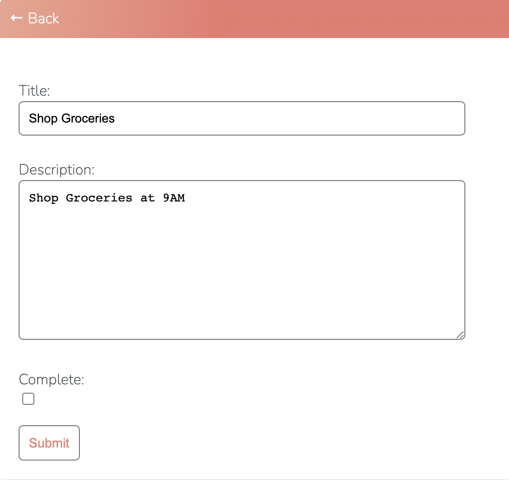
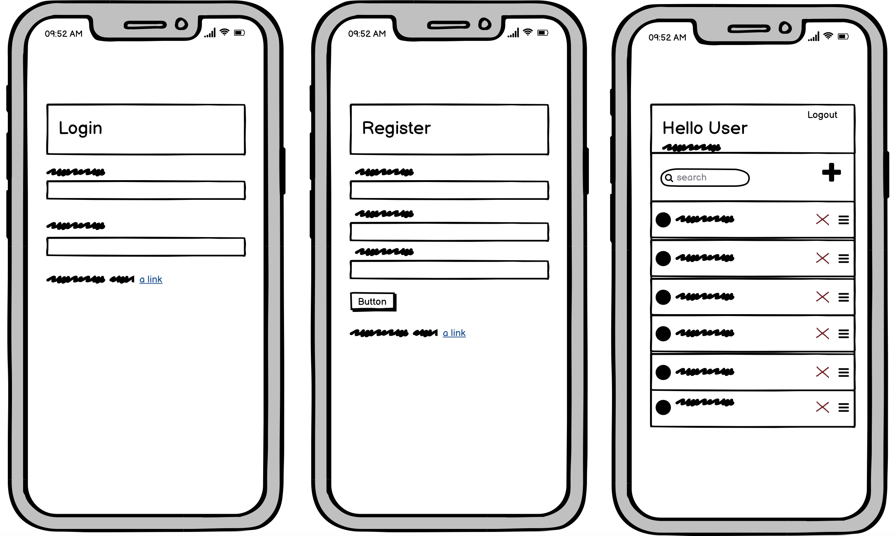

# To Do List Django APP with user authentication
[Live Link](https://msp4-todoapp.herokuapp.com/)

- ### This responsive, simplistic aesthetically pleasing app is designed using(CRUD) for people to create, read, update and delete their daily tasks, offers full functionality and benefits for the user.

## Features:

* ### Main Page:

- Main page offers a search task functionality, add task functionality, edit functionality, task counter, task list and a logout functionality:

    - 
      - Task counter, automatically counts and presents the amount of task the user has listed.\
       

    - 
      - Search bar functionality, allows the user to search a specified task.\
       

    - 
      - User can look up tasks by searching their first letter.\
       

    - 
      - When user clicks on the x icon next to task, user will be automatically redirected to a delete confirm page.
      - If confirmed, task will then be deleted from user's list.\
       
    - 
      - When user clicks on the + icon on the main page, user will then be automatically redirected to the create task page.
      - User can then specifiy the title of the task, it's description, whether task is complete or incomplete and submit task.\
       
    
    - 
      - When user clicks on a created task on the main page, user will be redirected to the creation page of that specific task.
      - Where user has the ability to edit or mark the task as complete/incomplete.\
       
    - 
      - If the user ticks the compelete box on the task's creation page, the task will appear at the bottom of the main page, in a strike through text, and a green light that declares that the task is completed.\
       
* ### User Authentication:

- Login page(home page), user will land on the login page when opening the page, if the user is not already logged in.
- User can also navigate to the login the page by clicking the 'Logout' button on the app's main page.
- User can input his/her username and password to login.
- If user doesn't already have an account, user can click on the 'Register' button\
       

  - 
    - If user clicks on 'Register' on the login page, user will be redirected to this registeration page
    - User will have to create an account username and password.\
     
  - 
    - Once user creates an account, user will be automatically redirected to app's main page, logged in.
    - This page welcomes the user with an automated message.
    - Enables user access to all app's functionality
    - Create a new task button will be visible, if the user have not created any tasks yet.\
     

## Incomplete/unimplemented features
- JS Based drag and order tasks features, drag n drop:
  - Feature implemented but in complete, user gets an error when they attempt to drag and reorder tasks.\
 
- Built in testing:
  - Django testing
  - Python testing
  - Testing with Jest
  - Testing with framework\
   

## Technologies used
- CRUD
- Django
- Python
- JS
- HTML
- CSS
- Github
- Gitpod
- Heroku
- Heroku Postgres
- MVC Framework
- Code Institute template
- Agile method (User stories)
- Online Testers and validators
- Chrome developer tool

## Bugs
- Drag and order feature bug, when user tries to drag and reorder task, page will break.
- Terminal errors
   - Line too long errors
   - Unused imports errors

## Testings
All app's features and interactivity function as intended, various testings were conducted.\
 

- Lighthouse\
 

- Python, No errors, tested on all pages.\
 
\
 
\
 

- HTML
   - No errors returned when passing through the official [W3C Validator](https://validator.w3.org/nu/?doc=https%3A%2F%2Fcode-institute-org.github.io%2Flove-running-2.0%2Findex.html)

 - CSS
   - No errors were found when passing through the official [(Jigsaw) Validator](https://jigsaw.w3.org/css-validator/validator?uri=https%3A%2F%2Fvalidator.w3.org%2Fnu%2F%3Fdoc%3Dhttps%253A%252F%252Fcode-institute-org.github.io%252Flove-running-2.0%252Findex.html&profile=css3svg&usermedium=all&warning=1&vextwarning=&lang=en#css)

- JS
  - No errors were found when passing through [JSHint](https://jshint.com/)

## User stories

## Deployment
Live link: https://msp4-todoapp.herokuapp.com/

Gihub Repo: https://github.com/SteveAlsamarae/MSP4-ToDoApp

## App Wireframes

## Credits
* Credits Code Institude, Help from mentor, and the slack community.

* Credits Code Institude tutor support

* Credits Code Institude Igor

* Credits Code Institude Johann

* Credits Code Institude Alan

* Credits Code Institude Sandeep

* Credits to University of Oxford

* Credits to https://docs.djangoproject.com/en/3.1/ref/class-based-views/

* Credits to http://ccbv.co.uk/

* Credits to https://jshint.com/ 

* Credits to https://jshint.com/ 

* Credits to https://validator.w3.org/ 

* Credits to https://jigsaw.w3.org/css-validator/ 

* Credits to https://www.pythonchecker.com/

* Credits to https://extendsclass.com/python-tester.html

* Credits to http://pep8online.com/

* Credits to https://cs50.edx.org/

* Credits to https://codeinstitute.net/

The concept of this app is not original.